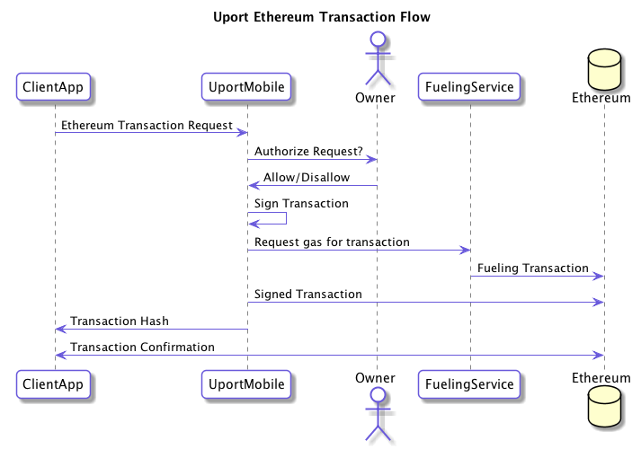

# Ethereum Transaction Flow

A client application can request that a user signs an Ethereum transaction.

The following shows the basic flow:

## Endpoint

Signed request should be sent to the following URLs:

- `https://id.uport.me/req/[JWT]`

*The following endpoints are deprecated*

The request should be sent to one of the following URLs:

- `me.uport:[ADDRESS]`
- `ethereum:[ADDRESS]`
- `https://id.uport.me/[ADDRESS]`

## Send Request

Create a valid signed or unsigned [Ethereum Transaction Request](../messages/tx.md) and send it to the uPort mobile app.

Signed example:

`https://id.uport.me/req/eyJ0eXAiOiJKV1QiLCJhbGciOiJFUzI1NksifQ.eyJp...`

The attributes `redirect_url` and `callback_type` can also be appended to the URL as encoded query parameters to specify how you want the response and control returned. For more details see [Messages](./index.md#json-web-token).

Unsigned example: (Deprecated)

`me.uport:2oDZvNUgn77w2BKTkd9qKpMeUo8EL94QL5V?transfer(address%200xdeadbeef%2C%20uint%205)&callback_url=https://mysite.com/callback&label=My%20Site`

## Client Callback

The client app SHOULD include a URL where the response is returned from the user. This can be a https url or a custom app url which receives the response.

Responses are param appended to a url fragment. If the callback requires the response as a HTTP POST, it is sent as a JSON POST request to the callback url instead.

### Successful Response

param | Description
----- | -----------
`tx`  | Ethereum Transaction Hash

The client app SHOULD verify that the transaction has been successfully included in a block.

### Errors

An `error` parameter is returned as the response to the Client App, containing one of following:

Error         | Description
------------- | -----------
access_denied | User denies the request
processing_error | Something went wrong submitting transaction to the blockchain
